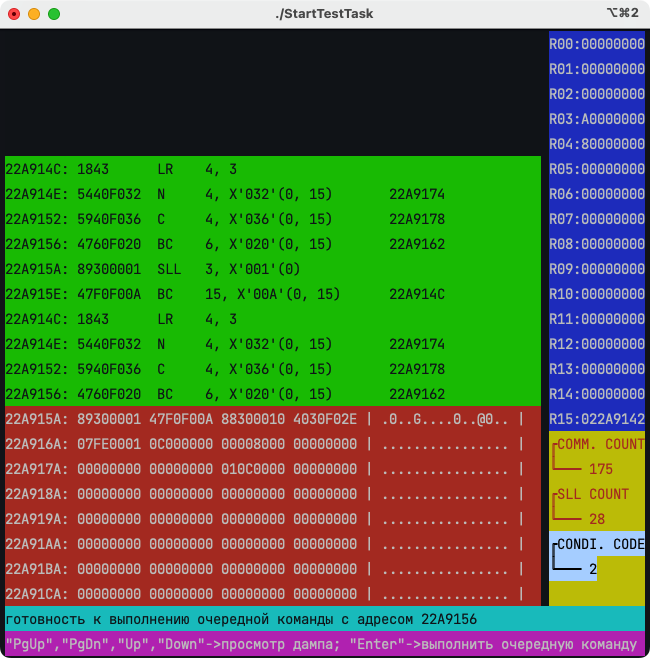

<!-- SPbSTU 报告起始 -->

<div align="center">
  <!--  新式 π logo -->
   <!-- 研究型大学 logo -->
  </br>
  <b><font size=3>Санкт-Петербургский политехнический университет Петра Великого</font></b>
  </br>
  <b><font size=2>Институт компьютерных наук и технологий</font></b>
  </br>
  <b><font size=2>Высшая школа программной инженерии</font></b>
</div>


<div align="center">
<b><font size=6>Системы программирования</font></b>


[](LICENSE)


</div>
<div align=left>
<div STYLE="page-break-after: always;"></div>
<!-- SPbSTU 报告结束 -->

  
> PS:
>
> 我只是在原有基础上修改了代码，原本的项目不是我编写的。我写不出这么糟糕的代码 :P
>
> Я просто изменил код из оригинала, я не писал оригинальный проект. Я не могу писать такой плохой код :P


[toc]


# 环境配置

## 使用 macOS

1. 使用 `brew` 装必备包：

    ```bash
    brew install mc ncurses
    ```

2. 使用 `SOURCE_UTF8_linux_lab_rab` 包中的内容！！！这个包里的代码已经经过了重新编码和优化，支持 64 位环境

3. 将 `Makefile` 中 `gcc -o absloadm.exe` 编译部分改为自己的 `-lncursesw` 环境，以便支持 `UTF-8`

4. 然后执行以下命令进行编译测试
    ```bash
    # 编译工程
    ./GenSysProg
    
    # 执行项目
    ./StartTestTask
    ```

    


## 使用 ubuntu

> 参考文档：`Рекомендация_3_Низкоуровневый_эквивалент_готов_Что_дальше`

启动 Docker 镜像后，需要安装包：

如果不想看下面这 4 步就直接执行命令：

```bash
apt-get update && apt-get install -y mc libncurses5-dev make gcc vim
```

1. 使用命令更新 apt：`apt-get update`
2. 使用 `sudo apt-get install mc` 指令添加 Midnight Comander (mc) 面板文件管理器软件包
3. 使用 `sudo apt-get install libncurses5-dev` 指令添加 ncurses 伪图形窗口软件包
4. 安装 `make` 和 `gcc`：`apt-get install make gcc`

---

然后将 `SOURCE_KOI8_linux_lab_rab` 中那堆糟糕的文件转换为 `UTF-8` 编码后编译：

- *（使用 `UTF8_linux_lab_rab` 包的话省略这一步）要将源文件从 KOI-8 重新编码为 UNICOD (UTF8)，请执行 shell 脚本 `ChangeCodTable`。*


# 实验工具包文件说明

## 初步说明

> 1. Данный комплект, состоящий из трех элементов учебной системы программирования и тестового задания:
>      - компилятор    PL/1 --> Ассемблер   ( komppl.c ),
>      - компилятор    Ассемблер --> объектный образ  ( kompassr.c ),
>      - абсолютный загрузчик, эмулятор и отладчик ( absloadm.c ),
>      - тестовое задание ( examppl.pli и spismod ).
>
> 2. Для получения исполняемых модулей двух компиляторов и абсолютного загрузчика следует выполнить Bash-скрипт GenSysProgr.
>
> 3. После получения исполняемого кода компиляторов можно запускать на выполнение тестовый пример с помощью Bash-скрипта StartTestTask.

| 文件                       | 说明                       | 功能                                  |
| -------------------------- | -------------------------- | ------------------------------------- |
| `komppl.c`                 | PL/1 编译器                | PL/1 --> 汇编（IBM System/370指令集） |
| `kompassr.c`               | 汇编编译器                 | 汇编 --> 对象                         |
| `absloadm.c`               | 绝对装载器、模拟器和调试器 |                                       |
| `examppl.pli` 和 `spismod` | 测试任务/代码              |                                       |

- 执行 Bash 脚本 `GenSysProgr`，获取**两个编译器**和**绝对加载器**的可执行文件（生成编程系统），该部分涉及从源代码 C 文件 `Komppl.c` 生成可执行文件 `Komppl.exe`。
- 获取编译器的可执行代码后，即可使用 `StartTestTask` Bash 脚本运行测试用例。`StartTestTask` 中有关从 TLD（即 `Komppl.exe` 文件）运行编译器的部分，以编译演示示例（即 `examppl.pli` 文件）。


- 验证编译器是否成功编译了演示示例 `examppl.ass` 的等效汇编文件，以及该汇编文件是否包含以下汇编文本：

| Метка | КОП   | Операнды | Пояснения                    |
| ----- | ----- | -------- | ---------------------------- |
| ex    | START | 0        | cчетчик отн. адреса в  нуль  |
|       | BALR  | RBASE,0  | отн. адр. базы в RBASE       |
|       | USING | *,RBASE  | Объявл. RBASE регистром базы |
|       | L     | RRAB,A   | Загрузка A в регистр RRAB    |
|       | A     | RRAB,B   | A+B грузим в RRAB            |
|       | S     | RRAB,C   | A+B-C грузим в RRAB          |
|       | ST    | RRAB,D   | A+B-C  из RRAB грузим в D    |
|       | BCR   | 15,RVIX  | Переход по адр. в  рег. RVIX |
| A     | DC    | F’3’     | A=3                          |
| B     | DC    | F’4’     | B=4                          |
| C     | DC    | F’5’     | C=5                          |
| D     | DS    | F        | Резерв памяти для D          |
| RBASE | EQU   | 5        | RBASE назначим 5             |
| RRAB  | EQU   | 3        | RRAB назначим 3              |
| RVIX  | EQU   | 14       | RVIX назначим 14             |
|       | END   |          | Конец текста блока           |


## absloadm.c

这段代码是一个仿真器，它模拟了一台IBM System/370（或类似架构）计算机的指令集的子集。这个仿真器使用了ncurses库来创建文本用户界面，允许用户观察和交互地跟踪程序的执行。程序主要分为几个部分：

1. **数据定义**：程序定义了多个数据结构和变量来存储模拟器的状态，如寄存器内容、内存区域、机器指令以及屏幕窗口。
2. **ncurses界面设置**：使用ncurses库创建和管理多个文本窗口，每个窗口显示不同的程序信息，如寄存器状态、内存内容等。
3. **指令处理**：为IBM System/370架构定义的指令实现了解析和执行的逻辑。这包括了操作码（opcode）和寄存器间的操作，如`BALR`和`BCR`。
4. **主循环**：程序中的`sys`函数包含了主循环，它处理指令的执行，更新寄存器和内存的状态，并在ncurses界面上更新显示。
5. **错误处理**：程序在执行过程中可能会遇到各种错误，这些错误在代码的末尾有详细的错误处理和消息输出。
6. **指令集**：程序实现了IBM System/370指令集的一部分，包括`BALR`、`BCR`、`ST`、`L`、`A`和`S`指令。这些指令涵盖了跳转、数据存储、加载和算术操作。
7. **程序启动与初始化**：`main`函数处理命令行参数，进行初步的文件处理，并调用`InitCurses`和`sys`函数来启动模拟器。

这个模拟器的目标是加载一个或多个编译后的模块（通常为二进制格式），并模拟它们的执行。模拟器使用了IBM System/370架构的汇编语言编写，并能够解释和执行一系列定义好的机器指令。程序还包含了一些基本的界面管理函数，用于在命令行界面显示和管理输出。


# 汇编指令

> 370 Instructions: http://www.simotime.com/asmins01.htm

| **Метка** 标签   | **КОП** 指令或操作码 | **Операнды** 指令所作用的数据或操作                         | 解释                                                         |
| ---------------- | -------------------- | ----------------------------------------------------------- | ------------------------------------------------------------ |
|                  | START                | самоопределенный терм или пробел<br />自定术语或空间        |                                                              |
|                  | END                  | перемещаемое выражение или пробел<br />可移动的表达式或空格 |                                                              |
| метка или пробел | USING                | v,r                                                         | `USING` 伪指令通常用来指定地址模式，它告诉汇编器如何将程序中的相对地址映射到内存中的绝对地址。具体地说，它将寄存器与内存地址相关联，以便在程序中使用基址寄存器进行有效地址的计算。这使得程序能够方便地使用基址寄存器来寻址内存，而不需要在每个内存引用中都指定全地址。 |
|                  |                      |                                                             |                                                              |


## 伪指令

### USING

`USING` 伪指令通常用来指定地址模式，它告诉汇编器如何将程序中的相对地址映射到内存中的绝对地址。具体地说，它将寄存器与内存地址相关联，以便在程序中使用基址寄存器进行有效地址的计算。这使得程序能够方便地使用基址寄存器来寻址内存，而不需要在每个内存引用中都指定全地址。

该指令用于传递给编译器两个方面的信息：首先是应该作为基址使用的相对偏移编号（伪指令的第一个操作数），其次是编译程序的相对地址，该地址对应于以所选基址为零偏移量的地址（伪指令的第二个操作数）。

| **Метка** 标签   | **КОП** 指令或操作码 | **Операнды** 指令所作用的数据或操作 | 解释               |
| ---------------- | -------------------- | ----------------------------------- | ------------------ |
| метка или пробел | USING                | v,r                                 | выбор базового РОН |

- v - 绝对或可移动表达式，
- r - 相关的 RON 号码，其内容与表达式 v 的值相关联。 

在这里使用术语“相关联”而不是“等于”并非偶然，因为程序员有责任正确加载 RON r，并且 USING 伪指令只是通知编译器在进一步处理程序时必须无条件地考虑到所指定的相关联。


**USING**：这是一个汇编器指令，不是机器指令。它告诉汇编器，某个寄存器（在这个例子中是RBASE）被用**作基址寄存器**，并且将与之相关的地址空间映射到这个寄存器。这样，后续的指令就可以用这个寄存器来访问内存，而不必每次都使用完整的地址。比如：`USING *,RBASE` 表明所有接下来的指令，直到下一个`USING`或`DROP`指令，都将`RBASE`作为基址。**RBASE**：这不是一个标准寄存器名，而是此处定义的一个符号名，通常指代一个寄存器，用于作为基址寄存器。在你的代码中，RBASE是被指定来存储当前程序计数器的值，使得后续指令可以相对于这个基址进行定位。

### 指令 BALR

**BALR (Branch And Link Register)**：这条指令用于分支并且在链接寄存器中记录返回地址。

- 将编译程序的长度增加两个字节。
- 通常用于将控制传递给子程序，然后返回到调用程序。
- 格式如下：

| 标签             | 助记符 | 操作数 | 解释                     |
| ---------------- | ------ | ------ | ------------------------ |
| метка или пробел | BALR   | R1,R2  | 将控制传递到子程序并返回 |

- 操作数:
    - R1: 包含返回地址的 RON 编号。
    - R2: 包含传递控制的地址的 RON 编号。如果 R2=0，则传递将执行到 BALR 指令后的下一条命令。

**比如：**`BALR RBASE,0` 的作用是将程序的下一个指令的地址放入`RBASE`寄存器中，并且因为第二个操作数是0，所以它不会导致跳转，仅仅是用来设置寄存器的值。

###  指令 EQU

- 说明:
    - 不改变编译程序的长度。
    - 用于告诉编译器，在后续的编译程序文本中，将指定在“标签”字段中的标识符与“操作数”字段中记录的绝对或可移动表达式等同（起别名）。
    - 格式如下：

| 标签 | 助记符 | 操作数 | 解释                                     |
| ---- | ------ | ------ | ---------------------------------------- |
| 标签 | EQU    | v      | 告知编译器标识符与绝对或可移动表达式等同 |

- 操作数:
    - v: 绝对或可移动表达式。

### 指令 BR

- 说明:
    - 增加编译程序的长度两个字节。
    - 用于在指定为唯一参数的寄存器中指定的地址处组织无条件的控制转移。
    - 格式如下：

| 标签  | 助记符 | 操作数 | 解释           |
| ----- | ------ | ------ | -------------- |
| метка | BR     | R      | 无条件控制转移 |

- 操作数:
    - R: 包含传输控制的地址的寄存器编号。


### 指令 L

- 说明:
    - 增加编译程序的长度**四个字节**。
    - **用于从标记的内存区域加载一个新的四字节值（字）到指定编号的寄存器中。**
    - 格式如下：

| 标签  | 助记符 | 操作数 | 解释                |
| ----- | ------ | ------ | ------------------- |
| метка | L      | R, M   | 加载到 RON R 的新值 |

- 操作数:
    - R: 新值将加载到的寄存器编号。
    - M: 对应于内存区域的标签，从中选择新值以加载到 RON 中。


### 指令 ST

- 说明:
    - 增加编译程序的长度四个字节。
    - 用于从指定编号的寄存器中**卸载**四字节内容（字），并存储到标记的内存区域中。
    - 格式如下：

| 标签  | 助记符 | 操作数 | 解释                        |
| ----- | ------ | ------ | --------------------------- |
| метка | ST     | R, m   | 将 RON R 中的值卸载到内存中 |

- 操作数:
    - R: 要卸载的寄存器编号。
    - m: 对应于内存区域的标签，其中将存储 RON 的内容。


### 指令 A

- 说明:
    - 增加编译程序的长度四个字节。
    - 用于将指定编号的寄存器中的四字节内容（单词）与内存中的单词**相加**，并将结果存储到用于存储第一个加法操作数的RON中。
    - 格式如下：

| 标签  | 助记符 | 操作数 | 解释                                               |
| ----- | ------ | ------ | -------------------------------------------------- |
| метка | A      | R,m    | 将 RON R 中的内容与存储在内存中标记为 m 的单词相加 |

- 操作数:
    - R: 包含第一个加法操作数的寄存器编号。
    - m: 对应于内存区域的标签，其中包含第二个加法操作数。

###  指令 S

- 说明:
    - 增加编译程序的长度四个字节。
    - 用于从指定编号的寄存器中**减去**内存中带有指定标签的单词，并将结果存储到用于存储第一个减法操作数的RON中。
    - 格式如下：

| 标签  | 助记符 | 操作数 | 解释                                 |
| ----- | ------ | ------ | ------------------------------------ |
| метка | S      | R,m    | 从 RON R 中减去内存中标记为 m 的单词 |

- 操作数:
    - R: 包含第一个减法操作数的寄存器编号。
    - m: 对应于内存区域的标签，其中包含第二个减法操作数。

### 伪指令 DC

- 说明:
    - 增加编译程序的长度，长度由该伪指令定义的常量确定。
    - 用于保留并初始化为该伪指令定义的常量的存储器区域。
    - 格式如下：

| 标签  | 助记符 | 操作数 | 解释     |
| ----- | ------ | ------ | -------- |
| метка | DC     | T V    | 定义常量 |

- 操作数:
    - T: 常量的类型（例如：F - 二进制字，X - 十六进制字节等）。
    - V: 常量的初始值（例如：'3'，'F3' 等）。

### 伪指令 DS

- 说明:
    - 增加编译程序的长度，长度由该伪指令定义的存储器区域确定。
    - 用于保留用于存储常量的存储器区域。
    - 格式如下：

| 标签  | 助记符 | 操作数 | 解释                   |
| ----- | ------ | ------ | ---------------------- |
| метка | DS     | T      | 定义用于存储常量的区域 |

- 操作数:
    - T: 常量的类型（例如：F - 二进制字，X - 十六进制字节等）。


### BCR

指令 `BCR 15,RVIX` 通常是用于跳转到寄存器 `RVIX` 中存储的地址。`BCR` 是一个分支指令，15 `是`条件码，它表示无条件跳转。`RVIX` 是一个通用寄存器，其中存储了要跳转的地址。因此，该指令的作用是无条件跳转到 `RVIX` 寄存器中存储的地址处执行代码。


## 句法中元素和符号

> Синтаксические правки - 语法编辑

| 元符号/符号 | 描述                      | 对应俄语描述                                        |
| ----------- | ------------------------- | --------------------------------------------------- |
| `<` 和 `>`  | 非终结符号的左右界定符    | левый и правый ограничители нетерминального символа |
| `::=`       | 元符号，意为“按定义等于”  | метасимвол со смыслом "равно по определению"        |
| `|`         | 替代定义的元符号“或”      | метасимвол альтернативного определения "или",       |
| `_`         | 终结符号，表示“空格”      | терминальный символ со смыслом "пробел"             |
| `<PRO>`     | 非终结符 “程序”           | нетерминал "программа"                              |
| `<OPR>`     | 非终结符 “程序序言操作符” | нетерминал "оператор пролога программы"             |
| `<IPR>`     | 非终结符 “程序名”         | нетерминал "имя программы"                          |
| `<IDE>`     | 非终结符 “标识符”         | нетерминал "идентификатор"                          |
| `<BUK>`     | 非终结符 “字母”           | нетерминал "буква"                                  |
| `<CIF>`     | 非终结符 “数字”           | нетерминал "цифра"                                  |
| `<TEL>`     | 非终结符 “程序体”         | нетерминал "тело программы"                         |
| `<ODC>`     | 非终结符 “声明操作符”     | нетерминал "оператор declare"                       |
| `<IPE>`     | 非终结符 “变量名”         | нетерминал "имя переменной"                         |
| `<RZR>`     | 非终结符 “位数”           | нетерминал "разрядность"                            |
| `<LIT>`     | 非终结符 “字面量”         | нетерминал "литерал"                                |
| `<MAN>`     | 非终结符 “尾数”           | нетерминал "мантисса"                               |
| `<OPA>`     | 非终结符 “算术赋值操作符” | нетерминал "оператор присваивания арифметический"   |
| `<AVI>`     | 非终结符 “算术表达式”     | нетерминал "арифметическое выражение"               |
| `<ZNK>`     | 非终结符 “符号”           | нетерминал "знак"                                   |
| `<OEN>`     | 非终结符 “程序尾声操作符” | нетерминал "оператор эпилога программы"             |


# 仿真计算机的特点
培训编程系统生成的可执行代码用于在 IBM-370 系统的目标计算机上执行。在 IBM PC 技术计算机上模拟该计算机时，应考虑到该计算机的以下一些特性。

## 内存

| 可寻址单位         | 长度（字节）<br /> | 长度（位） | 特点          |
| ------------------ | ------------------ | ---------- | ------------- |
| 字节/Байт          | 1                  | 8          | 无            |
| 半字/Полуслово     | 2                  | 16         | 地址为偶数    |
| 字/Слово           | 4                  | 32         | 地址为4的倍数 |
| 双字/Двойное слово | 8                  | 64         | 地址为8的倍数 |

- 寻址范围：从0到2^24-1，即内存大小上限为16MB。


## 可接受的数据格式

```
Короткое целое с фиксированной точкой
带有固定小数点位置的短整数
┌─┬───────────┐
│з│цел. двоичн│
└─┴───────────┘
0 1          15


Длинное целое с фиксированной точкой
带有固定小数点位置的长整数
┌─┬──────────────────────────┐
│з│целое двоичное            │
└─┴──────────────────────────┘
0 1                         31

...
```


# Ванрент №10

## PL/1 程序

```pl1
EX10: PROC OPTIONS ( MAIN );
      DCL A DEC FIXED INIT ( 10 );
      DCL B BIT ( 16 );
      B = A;
END EX10;
```


## IBM370 汇编

| Метка  | Коп   | Операнды     | Пояснения                                                    |
| ------ | ----- | ------------ | ------------------------------------------------------------ |
| EX10   | START | 0            | Начало  программы                                            |
|        | BALR  | @RBASE,0     | Относительный  адрес базы в @RBASE                           |
|        | USING | *,@RBASE     | Объявление  @RBASE регистром базы                            |
|        | MVC   | @BUF+5(3),A  | Перемещаем  из области памяти A в @BUF                       |
|        | CVB   | @RRAB,@BUF   | Преобразование  содержимое @BUF в двоичный формат и сохраните в @RRAB |
| @LOOP  | LR    | @RRAB1,@RRAB | Загрузка  значения @RRAB в @RRAB1 и установка метки выполнения цикла |
|        | N     | @RRAB1,@ONE  | Содержимое  регистра @RRAB1 AND 1                            |
|        | C     | @RRAB1,@ZERO | Сравнение  значения в регистре @RRAB1 с 0                    |
|        | BC    | 6,@BREAK     | Если  НЕ равно 0, то перейти к @BREAK (mask-bits: 0110)      |
|        | SLL   | @RRAB,1      | Cмещаем  @RRAB влево на 1 Bit                                |
|        | BC    | 15,@LOOP     | Безусловный  переход к @LOOP                                 |
| @BREAK | SRL   | @RRAB,16     | Метка  выхода из цикла, cмещаем @RRAB на 16 Bit вправо       |
|        | STH   | @RRAB,  B    | Сохранине  двоичные данные (полслова) в регистре @RRAB из B  |
|        | BCR   | 15,14        | Выход  из программы                                          |
| A      | DC    | PL3'10'      | Определение  A длиной 3 Byte с десятичным значением 10       |
|        | DS    | 0H           | Выравнивание  памяти для CVB                                 |
| B      | DS    | BL16         | Объявление  B двоичным хранилищем длиной 16 Bit              |
|        | DS    | 0F           | Выравнивание  памяти для CVB                                 |
| @ONE   | DC    | BL32'1'      | Определение  константы 1 для AND                             |
| @ZERO  | DC    | F'0'         | Определение  константы 0 для сравнения                       |
|        | DS    | 0F           | Выравнивание  памяти на границу слова                        |
| @BUF   | DC    | PL8'0'       | Определение  @BUF и выделение 8 Byte памяти с начальным значением 0 |
| @RRAB  | EQU   | 3            | @RRAB  назначим 3                                            |
| @RRAB1 | EQU   | 4            | @RRAB  назначим 4                                            |
| @RBASE | EQU   | 15           | @RBASE  назначим 15                                          |
|        | END   |              | Конец  программы                                             |


## DS/DF内存对齐

在 IBM 370 汇编语言中，`DS` (Define Storage) 指令用于在程序的内存布局中保留空间。该指令的操作数定义了应保留的空间类型和大小。`0H` 和 `0F` 是特定的 `DS` 指令操作数，它们用于控制数据的对齐。

### 解释 `0H` 和 `0F`：

1. **`DS 0H`**:
    - `0H` 表示保留足够的空间，使得下一个数据项与下一个半字（halfword，2字节）边界对齐。
    - **如果当前位置已经在半字边界上，它不会保留任何额外空间。如果不在，则保留最小的空间直到达到下一个半字边界。**
2. **`DS 0F`**:
    - `0F` 表示保留足够的空间，使得下一个数据项与下一个整字（fullword，4字节）边界对齐。
    - 同样地，如果当前位置已经在整字边界上，不会保留任何额外空间。如果不在整字边界上，则保留足够的空间以达到下一个整字边界。

### 占用的字节数：

- 由于 `0H` 和 `0F` 用于对齐而不直接定义特定数量的字节，所以它们实际占用的字节取决于当前数据位置与下一个对齐边界的距离。这意味着：
    - 如果数据已经对齐，`DS 0H` 和 `DS 0F` 可能不占用任何字节。
    - 如果数据未对齐，`DS 0H` 可能占用 1 个字节（如果当前位置偏离半字边界1个字节）。
    - `DS 0F` 可能占用从1到3个字节，具体取决于需要多少字节才能达到下一个整字边界。

### 使用场景：

这种对齐操作在编程中很重要，因为某些机器指令（尤其是老式机器如 IBM 370）要求数据必须按照特定的边界对齐，以提高访问速度或满足硬件要求。正确的对齐可以避免额外的处理时间和潜在的运行时错误。


## 指令长度及地址

| Длина     (Byte) | Отн.      Адрес (HEX) | Метка  | Коп   | Операнды     | Машинный код операнды | Машинный код            | Пояснения                                                    |
| ---------------- | --------------------- | ------ | ----- | ------------ | --------------------- | ----------------------- | ------------------------------------------------------------ |
| 0                | 0x00                  | EX10   | START | 0            |                       |                         | Начало программы                                             |
| 2                | 0x00                  |        | BALR  | @RBASE,0     | 0x05                  | 05 F0                   | Относительный  адрес базы в @RBASE                           |
| 0                | 0x02                  |        | USING | *,@RBASE     |                       |                         | Объявление  @RBASE регистром базы                            |
| 6                | 0x02                  |        | MVC   | @BUF+5(3),A  | 0xD2                  | D2 02 F0 3F F0 2A       | Перемещаем из  области памяти A в @BUF                       |
| 4                | 0x08                  |        | CVB   | @RRAB,@BUF   | 0x4F                  | 4F 30 F0 3A             | Преобразование  содержимое @BUF в двоичный формат и сохраните в @RRAB |
| 2                | 0x0C                  | @LOOP  | LR    | @RRAB1,@RRAB | 0x18                  | 18 43                   | Загрузка  значения @RRAB в @RRAB1 и установка метки выполнения цикла |
| 4                | 0x0E                  |        | N     | @RRAB1,@ONE  | 0x54                  | 54 40 F0 32             | Содержимое  регистра @RRAB1 AND 1                            |
| 4                | 0x12                  |        | C     | @RRAB1,@ZERO | 0x59                  | 59 40 F0 36             | Сравнение  значения в регистре @RRAB1 с 0                    |
| 4                | 0x16                  |        | BC    | 6,@BREAK     | 0x47                  | 47 60 F0 20             | Если НЕ равно 0,  то перейти к @BREAK (mask-bits: 0110)      |
| 4                | 0x1A                  |        | SLL   | @RRAB,1      | 0x89                  | 89 30 00 01             | Cмещаем @RRAB  влево на 1 Bit                                |
| 4                | 0x1E                  |        | BC    | 15,@LOOP     | 0x47                  | 47 F0 F0 0A             | Безусловный  переход к @LOOP                                 |
| 4                | 0x22                  | @BREAK | SRL   | @RRAB,16     | 0x88                  | 88 30 00 10             | Метка выхода из  цикла, cмещаем @RRAB на 16 Bit вправо       |
| 4                | 0x26                  |        | STH   | @RRAB,  B    | 0x40                  | 40 30 F0 2E             | Сохранине  двоичные данные (полслова) в регистре @RRAB из B  |
| 2                | 0x2A                  |        | BCR   | 15,14        | 0х07                  | 07 FE                   | Выход из  программы                                          |
| 3                | 0x2C                  | A      | DC    | PL3'10'      |                       | 00 01 0C                | Определение A  длиной 3 Byte с десятичным значением 10       |
| 1                | 0x2F                  |        | DS    | 0H           |                       | XX                      | Выравнивание  памяти                                         |
| 2                | 0x30                  | B      | DS    | BL16         |                       | 00 00                   | Объявление B  двоичным хранилищем длиной 16 Bit              |
| 2                | 0x32                  |        | DS    | 0F           |                       | XX  XX                  | Выравнивание  памяти                                         |
| 4                | 0x34                  | @ONE   | DC    | BL32'1'      |                       | 80 00 00 00             | Определение  константы 1 для AND                             |
| 4                | 0x38                  | @ZERO  | DC    | F'0'         |                       | 00 00 00 00             | Определение  константы 0 для сравнения                       |
| *0*              | *0x3C*                | **     | *DS*  | *0F*         |                       | *-*                     | *Выравнивание  памяти на границу слова*                      |
| 8                | 0x3C                  | @BUF   | DC    | PL8'0'       |                       | 00 00 00 00 00 00 00 0C | Определение @BUF  и выделение 8 Byte памяти с начальным значением 0 |
|                  | 0x40                  | @RRAB  | EQU   | 3            |                       |                         | @RRAB назначим 3                                             |
|                  |                       | @RRAB1 | EQU   | 4            |                       |                         | @RRAB назначим 4                                             |
|                  |                       | @RBASE | EQU   | 15           |                       |                         | @RBASE назначим  15                                          |
|                  |                       |        | END   |              |                       |                         | Конец программы                                              |


---


@BUF 的内容如果为：`00000000 0000010C`，@RRAB 为 IBM370 的 3 号寄存器。那么在执行 `CVB @RRAB,@BUF`  之后，@RRAB的内容是是：

在 IBM 370 指令集中，`CVB` 指令用于将打包的十进制数转换成二进制值。给定您的描述，我们有以下信息：

- **@BUF** 中的内容为 `00000000 0000010C`，其中 "0000010C" 是一个打包的十进制数字。
- **@RRAB** 是 IBM 370 的第 3 号寄存器。


**打包的十进制表示解析：**

- 打包的十进制数字 `0000010C` 实际上包含一个打包的十进制值 `010` 和一个符号 `C`。
- `010` 十进制等于 `10`（这是数值部分）。
- `C` 在打包的十进制中代表正数（+）。


**执行 `CVB` 指令：**

- `CVB` 指令将打包的十进制数 `010` 转换为二进制形式。
- 十进制数 `10` 转换成二进制是 `0000000A`。

因此，执行 `CVB @RRAB,@BUF` 指令后，@RRAB 寄存器的内容将是十进制 `10` 的二进制表示 `0000000A`。


**@RRAB 寄存器的最终内容：**

- 二进制表示为 `0000000A`。
- 因为你请求十六进制输出，结果是 `0x0000000A`。

所以，在执行了 `CVB @RRAB,@BUF` 之后，寄存器 @RRAB 应包含值 `0x0000000A`。这表明寄存器内的值是十进制值 `10` 的二进制表达。


## 指令格式

根据 [IBM370 指令](http://www.simotime.com/asmins01.htm)，我们可以学习 TMC 和新助记符的长度。

| **Мнемоника** | **КОП**  | **Длина в байтах** | **Тип** |
| ------------- | -------- | ------------------ | ------- |
| BALR          | 0х05     | 2                  | RR      |
| L             | 0х58     | 4                  | RX      |
| A             | 0х5A     | 4                  | RX      |
| S             | 0х5B     | 4                  | RX      |
| ST            | 0х50     | 4                  | RX      |
| **MVC**       | **0xD2** | **6**              | **SS**  |
| **CVB**       | **0x4F** | **4**              | **RX**  |
| **LR**        | **0x18** | **2**              | **RR**  |
| **N**         | **0x54** | **4**              | **RX**  |
| **C**         | **0x59** | **4**              | **RX**  |
| **BC**        | **0x47** | **4**              | **RX**  |
| **SLL**       | **0x89** | **4**              | **RS**  |
| **SRL**       | **0x88** | **4**              | **RS**  |
| **STH**       | **0x40** | **4**              | **RX**  |
| BCR           | 0х07     | 2                  | RR      |

在 IBM 370 汇编语言中，表格中的“Тип”一列表示指令格式。IBM 370 使用多种不同的指令格式来处理不同类型的操作。每种格式定义了指令的结构，包括操作码、寄存器、偏移量、地址等字段的组织方式。下面是“Тип”列中提到的几种指令格式的解释：

### RR (Register-Register)

- **RR** 格式的指令涉及两个寄存器。这类指令不涉及内存地址，仅在寄存器间进行数据操作或比较。
- **示例**: `BALR` 和 `LR` 指令属于此类，它们使用两个寄存器来完成任务，如 `BALR R1, R2`，意味着将程序的控制权转移给由 R2 指定的地址，并将返回地址存储在 R1。

### RX (Register-Indexed)

- **RX** 格式的指令涉及一个寄存器和一个内存地址，地址可以是由基址寄存器和索引寄存器加上一个偏移量计算得出。
- **示例**: `L`（加载）、`A`（加法）、`S`（减法）等，如 `L R1, 100(R2,R3)` 指从由 R2 和 R3 寄存器加上偏移量 100 计算得出的内存地址加载数据到 R1。

### SS (Storage-Storage)

- **SS** 格式的指令涉及两个内存地址。这些指令通常用于在内存区域之间移动数据或比较内存区域的内容。
- **示例**: `MVC` 是一个 SS 类型的指令，它用于将数据从一个内存地址复制到另一个内存地址，如 `MVC 2000(5,R1),1000(5,R2)`，表示从地址 `1000 + (R2)` 开始的 5 个字节复制到地址 `2000 + (R1)` 开始的位置。

### RS (Register-Storage)

- **RS** 格式的指令涉及一个寄存器和一个内存地址。
- **示例**: `SLL` 和 `SRL` 属于此类，用于对寄存器中的数值进行逻辑位移操作。

这些指令格式允许 IBM 370 指令集灵活地处理不同的数据操作和控制流需求，通过不同类型的指令格式来适应各种运算和内存访问模式。每种格式的选择取决于操作的性质和涉及的数据类型（寄存器或内存）。


## 仿真器

1. **初始状态截图**：展示了程序启动前内存和寄存器的初始状态。

    

2. **执行 `MVC @BUF+5(3),A` 操作**：将寄存器 `A` 的值复制到内存地址 `@BUF+5` 开始的三个字节内。

    

3. **执行 `CVB @RRAB,@BUF` 操作后**：将内存地址 `@BUF` 中的打包十进制值转换为二进制格式，并存储到寄存器 `@RRAB`。

    

4. **执行 `LR @RRAB1,@RRAB` 后**：将寄存器 `@RRAB` 的值加载到寄存器 `@RRAB1`。

    

5. 第一次执行完 `N @RRAB1,@ONE` 后，寄存器 @RRAB1 中值的变化

    

6. **重复执行 `SLL @RRAB,1`**：在循环中不断左移寄存器 `@RRAB` 的值，直到 `N @RRAB1,@ONE` 使得 @RRAB1 寄存器中的结果不为零（0x80000000）

    

7. 执行完 `C @RRAB1,@ZERO`，条件码（*Condition Code*）从 0 变化到 2，表示比较结果为非零，准备退出循环

    

8. 程序跳转到 @BREAK 执行 `SRL @RRAB,16`，将寄存器 @RRAB 中的值右移 16 位

    

9. 执行完 `STH @RRAB, B`，寄存器 `@RRAB` 中的低 16 位（半字）存储到由 `B` 指定的内存地址处

    
